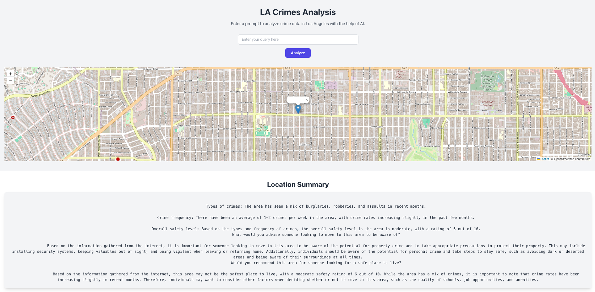

# Capstone Project - LA Crimes Analysis
***


****
## Team Members

1. Jonathan Darius
2. Trisha Siva
3. Dylan Vuong
4. Kushal Tirupathi
5. Joel Castillo-Pinto
****


****
## Prerequisites
1.  **Python 3.8+**  
  Download and install from the [official Python website](https://www.python.org/downloads/).
2. **Pyspark**
  ```bash
  pip install pyspark
  ```
3. **Node.js and npm**
Download and install from the [official Node.js website](https://nodejs.org/)

****

## Step 1:
First, install [Node.js](https://nodejs.org/), which includes npm (Node Package Manager).

- Go to the [official Node.js website](https://nodejs.org/)
- Download and install the LTS (Long Term Support) version for your operating system
- Confirm the installation by running the following commands in your terminal:

```bash
node -v
npm -v
```

Once you've installed npm, please run:
```bash
npm install
```
This will install of the dependencies that we are using

****
## Step 2:
Please install the dataset for our project:

https://catalog.data.gov/dataset/crime-data-from-2020-to-present

This data has entires that have LA Crimes dating from 2020-2024.

Please place the dataset in the data folder in the **backend/data** folder.
****
## Step 3:
If you guys want to add more preprocessing to the data (ex. I've replaced at the gender NULLs with imputed values).

If you want to add to preprocessing, go to the **backend/preprocess.py** file.

If you want to work on queries, go to the **backend/analysis.py**

****
## Step 4:
To run the scripts, navigate to the backend directory and run:

```bash
python preprocess.py
```

OR

```bash
python analysis.py
```

Then to start the website just run:
```bash
npm start build
```
